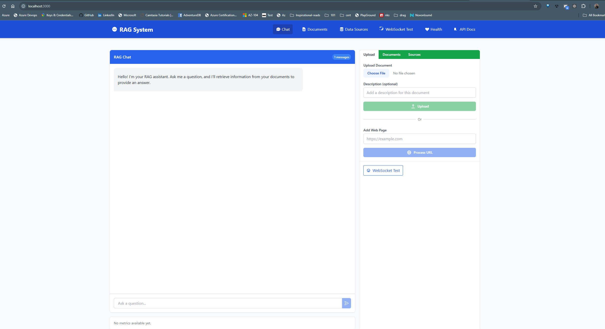
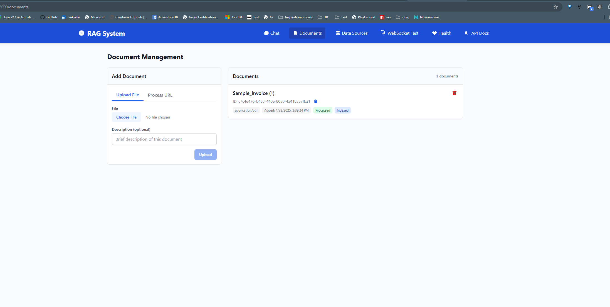
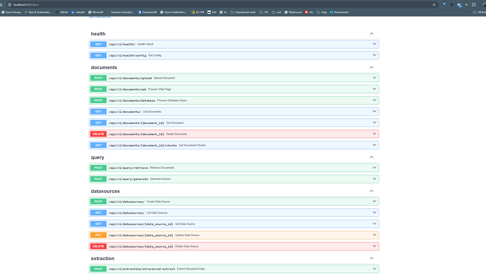
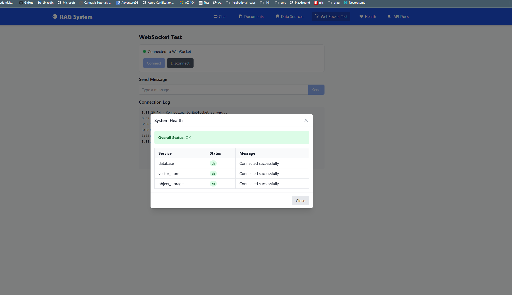
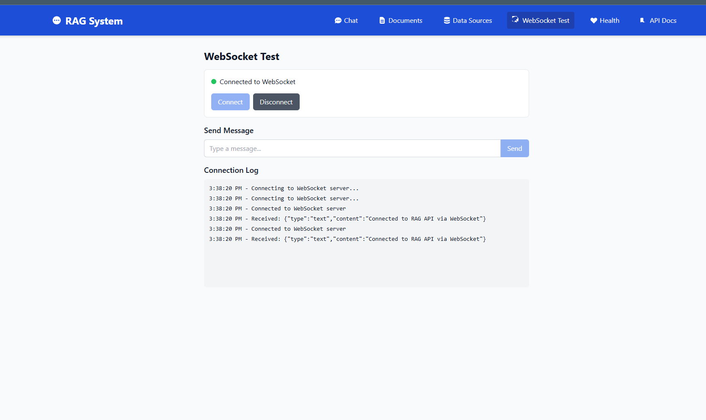

# Comprehensive RAG System

A Retrieval-Augmented Generation (RAG) system for querying and extracting insights from your documents using Large Language Models.

{: .fs-6 .fw-300 }

[Get Started](getting-started/){: .btn .btn-primary .fs-5 .mb-4 .mb-md-0 .mr-2 }
[View on GitHub](https://github.com/nitin27may/rag){: .btn .fs-5 .mb-4 .mb-md-0 }

## Overview

This system allows you to:

- Upload and process documents (PDF, DOCX, TXT, CSV, XLSX, JSON, images)
- Extract information from web pages
- Index data from databases (PostgreSQL, MySQL, SQLite)
- Query your documents using natural language
- Select specific documents or search across all content
- Get AI-generated answers based on your document content
- Extract structured data from unstructured documents

## Key Features

- **Document Ingestion**: Process files (PDF, DOCX, TXT, CSV, XLSX, JSON, images), web pages, and database content
- **Configurable Chunking**: Multiple chunking strategies (recursive, semantic, token, sentence) for optimal retrieval
- **Vector Search**: Semantic similarity search using PostgreSQL with PGVector
- **Multi-Document Selection**: Query specific documents or search across all indexed content
- **Database Connector**: Query and index data directly from PostgreSQL, MySQL, or SQLite databases
- **Hybrid Retrieval**: Combine vector search with keyword filtering for more relevant results
- **Question-Answering**: Generate accurate responses based on context from your documents
- **Structured Extraction**: Extract specific data from documents using customizable schemas
- **Modern Web Interface**: Next.js 15 with React 19 UI for document management and querying
- **RESTful API**: Comprehensive API for integration with other systems
- **WebSocket Support**: Real-time streaming responses
- **Health Monitoring**: System health checks for all components

## Screenshots

### Document List

### API Interface

### Health Check

### WebSocket Test
