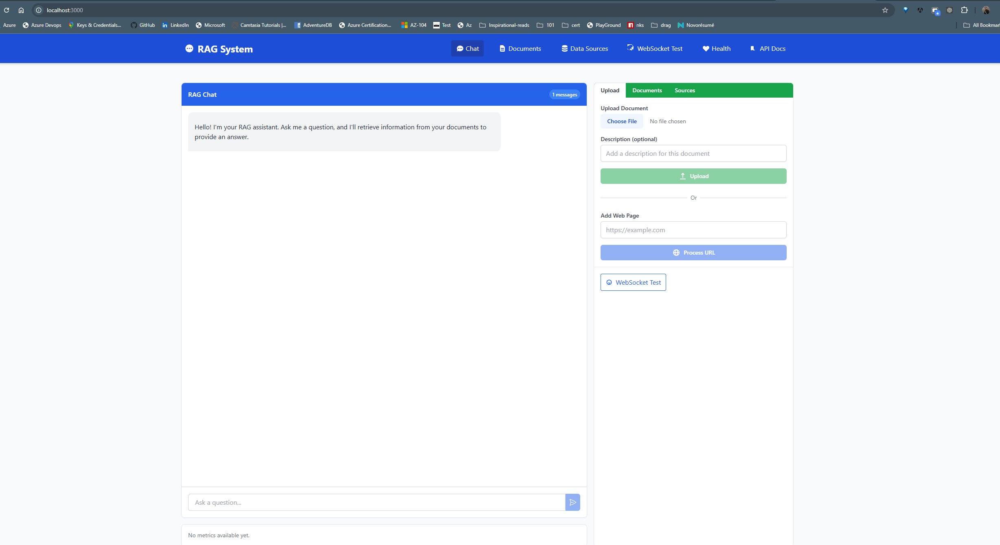
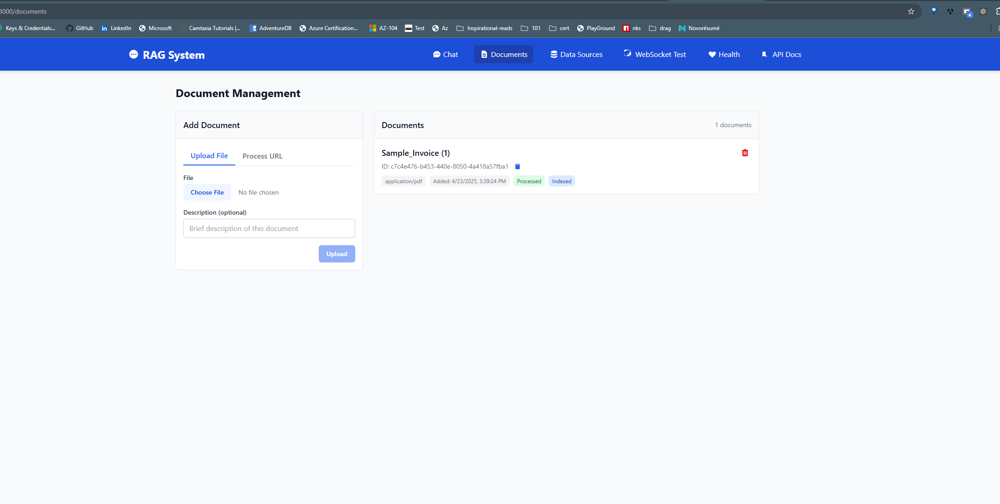
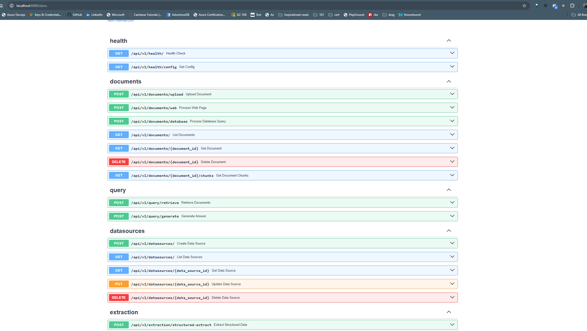
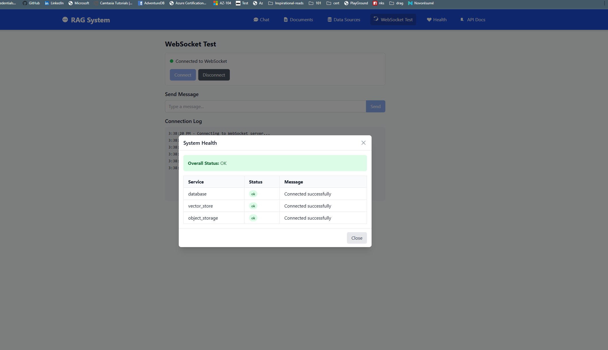
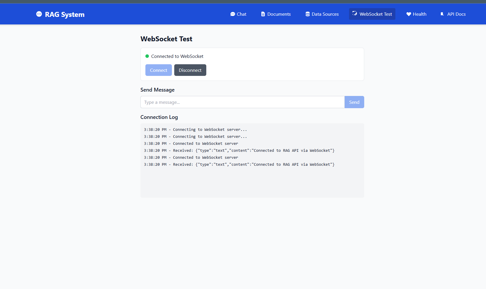

# Comprehensive RAG System

A Retrieval-Augmented Generation (RAG) system for querying and extracting insights from your documents using Large Language Models.

{: .fs-6 .fw-300 }

[Get Started](getting-started/){: .btn .btn-primary .fs-5 .mb-4 .mb-md-0 .mr-2 }
[View on GitHub](https://github.com/yourusername/rag){: .btn .fs-5 .mb-4 .mb-md-0 }

## Overview

This system allows you to:

- Upload and process documents (PDF, DOCX, TXT, CSV, XLSX, images)
- Extract information from web pages
- Query your documents using natural language
- Get AI-generated answers based on your document content
- Extract structured data from unstructured documents

## Key Features

- **Document Ingestion**: Process files (PDF, DOCX, TXT, CSV, XLSX, images), web pages, and database content
- **Vector Search**: Semantic similarity search using ChromaDB with embedding models
- **Hybrid Retrieval**: Combine vector search with keyword filtering for more relevant results
- **Question-Answering**: Generate accurate responses based on context from your documents
- **Structured Extraction**: Extract specific data from documents using customizable schemas
- **Modern Web Interface**: React-based UI for document management and querying
- **RESTful API**: Comprehensive API for integration with other systems
- **WebSocket Support**: Real-time updates and notifications
- **Multiple Data Sources**: Connect to file systems, databases, websites, and APIs
- **Health Monitoring**: System health checks for all components

## Screenshots

### Document List

### API Interface

### Health Check

### WebSocket Test
